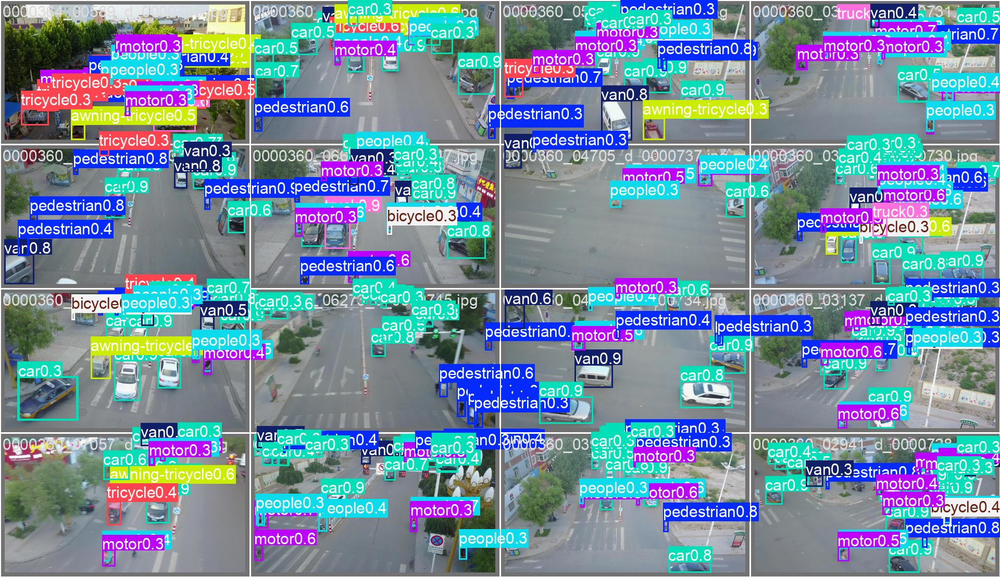
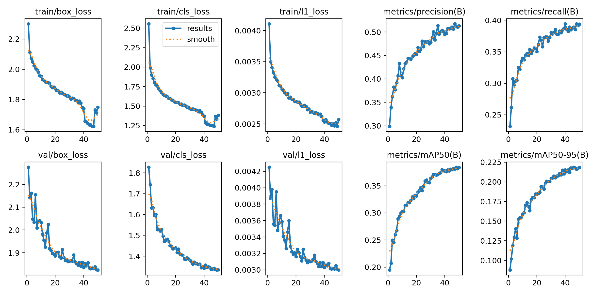
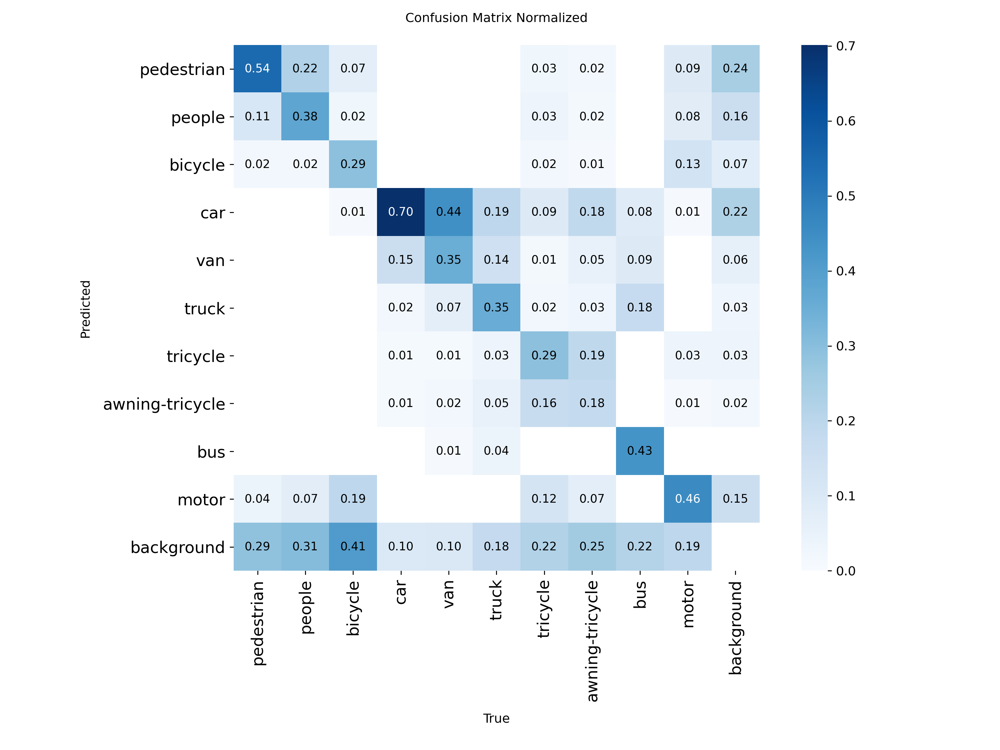
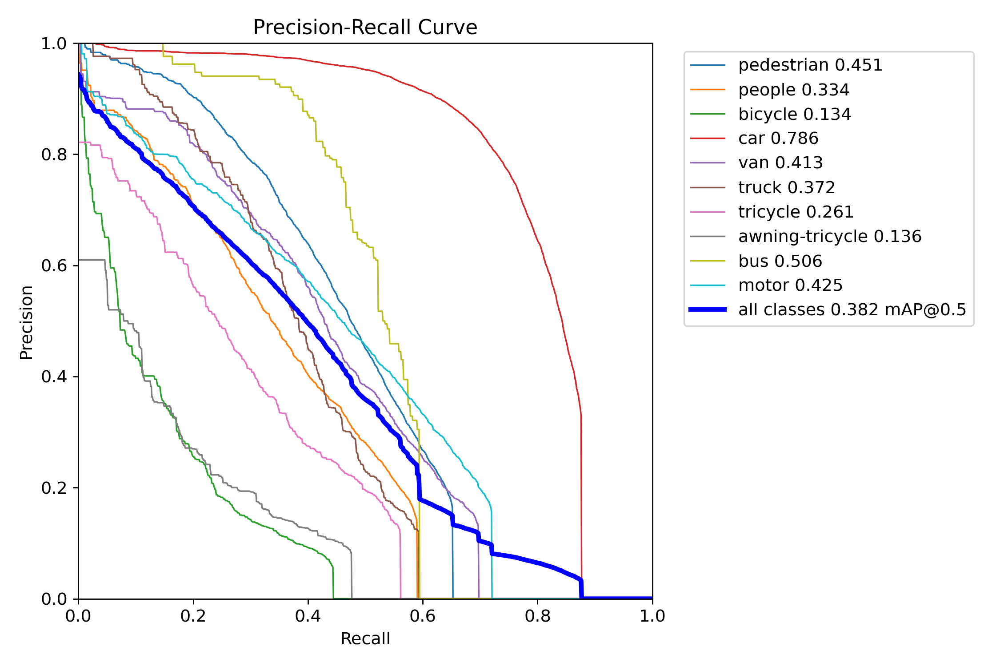
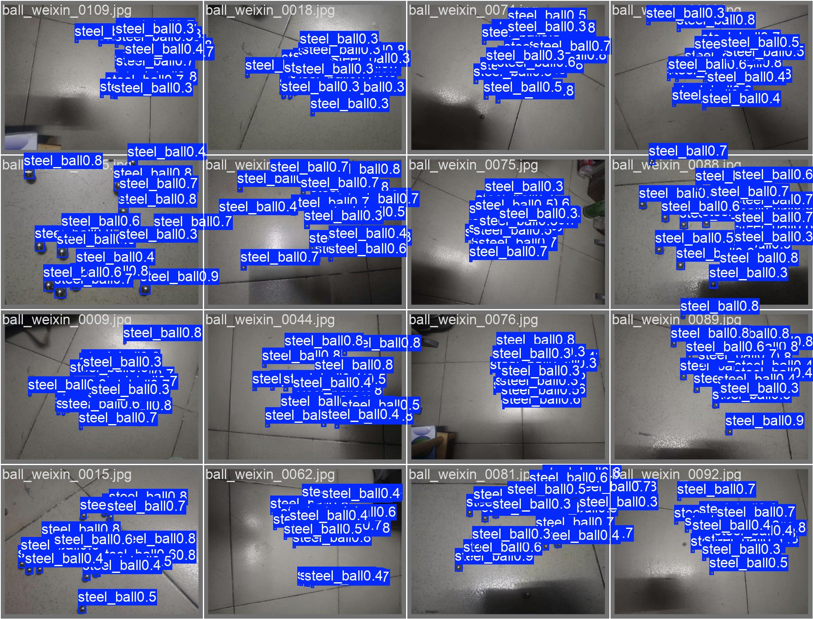
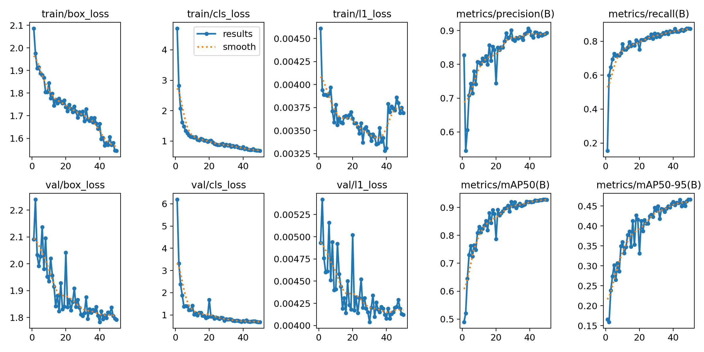
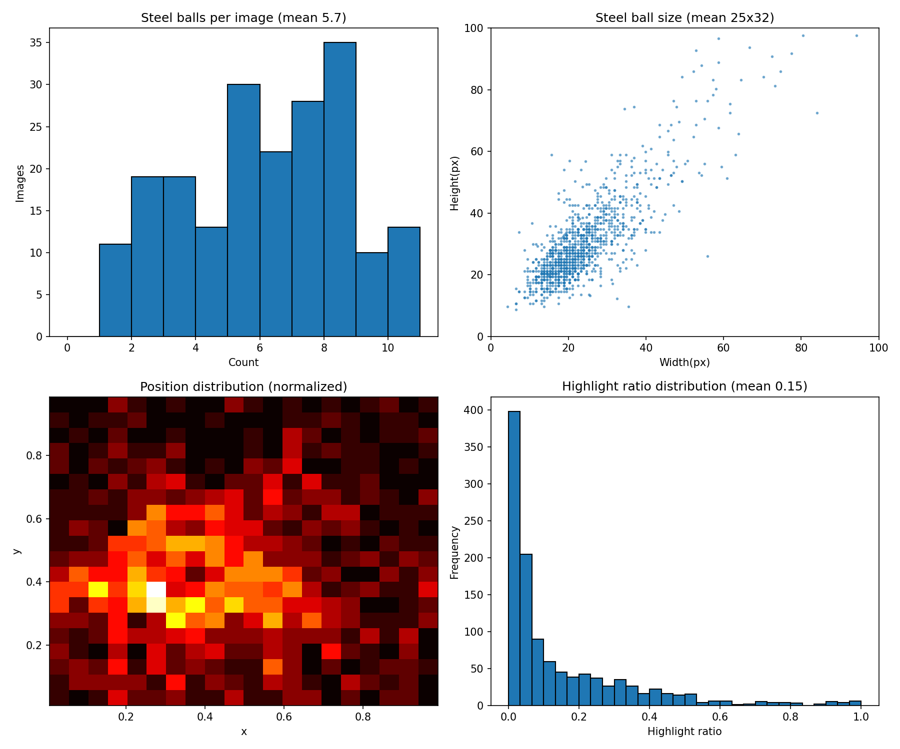

# YOLO 小目标检测应用集 🎯

> 基于 YOLO 系列的低空/工业场景小目标检测项目，以**应用流程闭环**（数据→训练→评估→部署）为统一方法论，覆盖多个应用领域。

---

## 🎯 核心方法论

```
数据准备 → 训练微调 → 评估优化 → 部署上线
```

**评估不是看单个 mAP**：综合 Precision/Recall/AP_small/按类别/混淆矩阵诊断，针对场景痛点加权优化（详见 [评估方法论](docs/EVALUATION_METHODOLOGY.md)）。

## 📊 应用全景

| 应用 | 模型 | 数据 | 核心成果 | 状态 |
|---|---|---|---|---|
| [VisDrone 小目标检测](#visdrone-低空小目标检测) | YOLO26s | 10类 | mAP50 **0.38**（SAHI +27%）| ✅ 完成 |
| [钢珠检测+直径测量](#钢珠检测直径测量) | YOLO26n | 单类1943张 | mAP50 **0.93** | ✅ 完成 |
| [风电叶片缺陷检测](applications/wind-turbine/) | YOLOv11n | 5类 | 多缺陷识别 | ✅ 完成 |

## VisDrone 低空小目标检测

无人机俯拍场景，目标小（几个像素）、背景复杂——小目标检测的典型难点。

### 成果

| 方法 | mAP@0.5 | mAP@0.5:0.95 | 说明 |
|---|---|---|---|
| COCO 预训练基线 | 0.298 | 0.166 | 未微调 |
| **YOLO26s 微调** | **0.382** | 0.219 | 本模块成果 |
| **SAHI 切片推理** | **0.381** | 0.200 | 同阈值对比 +27% |

### 诊断（评估方法论应用）

- **漏检为主**（Recall 0.39 < Precision 0.51）：小目标典型问题
- **最难类别**：bicycle/awning-tricycle（AP 0.13-0.14）——小且外观相似
- **最好类别**：car（AP 0.79）——大目标特征清晰
- **优化**：SAHI 切片推理提升小目标（bicycle 0.13→0.17）

### 效果展示

**检测效果**（YOLO26 验证集）：



**训练曲线**：



**评估分析**（混淆矩阵）：



**PR 曲线**：



## 钢珠检测+直径测量

独立应用分支：检测钢珠 + 测量直径 + 反光特征利用。

### 成果

| 项 | 结果 |
|---|---|
| mAP@0.5 | **0.93** |
| Precision / Recall | 0.89 / 0.88 |
| 推理速度 | 15ms/图（60fps+）|
| 直径测量 | bbox → 像素直径 → 标定 → 物理直径 |

### 成果文件

| 文件 | 说明 |
|---|---|
| [best.pt](applications/steel-ball/results/best.pt) | 训练好的钢珠模型权重 |
| [metrics.json](applications/steel-ball/results/metrics.json) | 评估指标 |

**检测效果**（高光特征校验 + 直径测量）：



**训练曲线**：



**数据分布**（EDA：尺寸/数量/反光）：



### 技术亮点

- **反光特征**：钢珠高光点是稳定指纹（bbox 内高光占比 0.15），作辅助校验
- **EDA 分析**：25×32px 小目标、平均 5.7 球/图
- **实时性能**：PyTorch **95 FPS**（实测），满足实时控制需求

## ⚡ 实时性能（部署能力）

实测帧率（NVIDIA GPU，详见 [部署能力分析](docs/DEPLOYMENT_CAPABILITY.md)）：

| 部署方案 | 帧率 | 场景 |
|---|---|---|
| PyTorch GPU | **86-95 FPS** | 实时控制、开发验证 |
| ONNX CPU | 45-47 FPS | 跨平台部署 |
| 嵌入式 (K230) | 30-60 FPS | 边缘/车载 |

**能力**：检测→测量→实时 60fps+ 全链路，ONNX 跨平台部署。

## 🖥️ 可视化交互

- **WebUI 交互页**：上传图片检测钢珠 + 直径测量
- **视频检测**：实时视频流检测 + 帧率显示（60fps+）
- 路径：`apps/steelball-webui/`

## 🚀 部署

训练好的模型可导出部署（详见 [部署指南](docs/DEPLOYMENT_GUIDE.md)）：

```bash
# ONNX 导出
python scripts/deploy_yolo.py export --model best.pt

# WebUI 交互页（钢珠检测）
python apps/steelball-webui/app.py
```

## 📚 文档

| 文档 | 内容 |
|---|---|
| [知识体系](docs/tutorial/00-README.md) | 从原理到应用的 **9 篇教程**（含 ViT 视觉编码器）|
| [评估方法论](docs/EVALUATION_METHODOLOGY.md) | 综合诊断→针对性优化 |
| [部署指南](docs/DEPLOYMENT_GUIDE.md) | 部署原理与实践 |
| [部署能力分析](docs/DEPLOYMENT_CAPABILITY.md) | 帧率基准与部署方案 |
| [工程总结](docs/TECHNICAL_SUMMARY.md) | 精炼技术概览 |
| [项目概览](docs/PROJECT_OVERVIEW.md) | 闭环框架全景 |

## 🤝 规范

- [贡献指南](CONTRIBUTING.md) / [MIT License](LICENSE)

---

*从感知到执行：YOLO 小目标检测是完整视觉能力的第一个应用闭环。*
